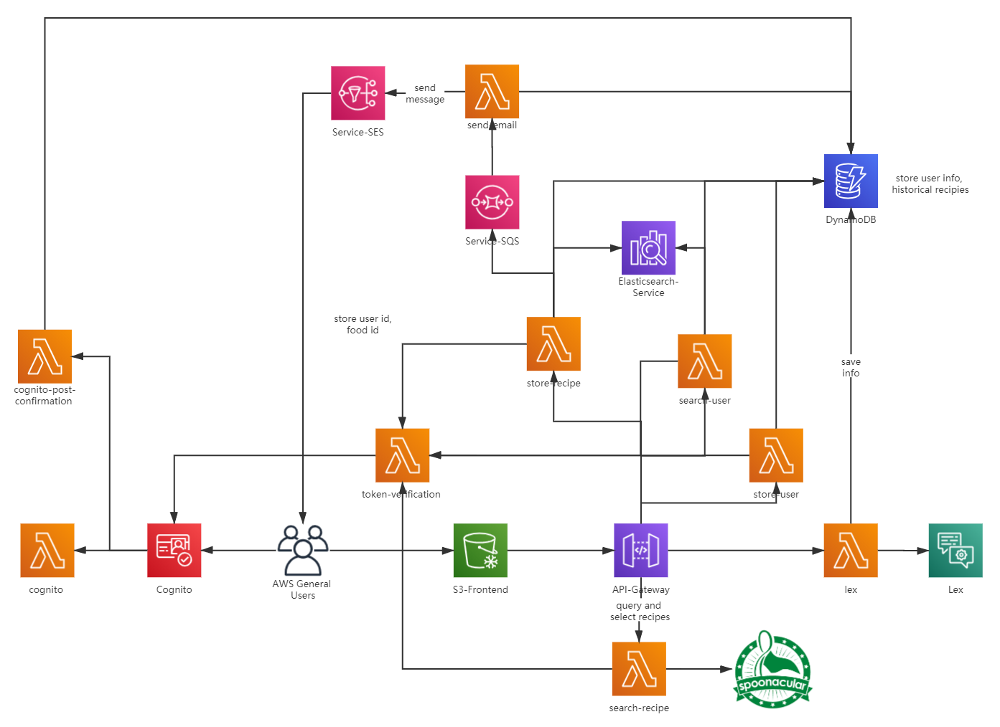

# COMSE6998 Project: Foodle

## Introduction
Foodle is a web application for recipe searching and intake monitoring. Based on users' body conditions and taste preference, this app will display various matching dishes with nutrition information and cooking instructions.

Visit the deployed website at http://comse6998-project-foodle.s3-website-us-east-1.amazonaws.com/

## Architecture

## API List
- 9 Lambda functions
    - Cognito/cognito-post-confirmation/token-verification: access control for Cognito
    - Store/search-user: save or search user information in DynamoDB/Elasticsearch
    - Store/search-recipe: save users’ recipe frequencies in Elasticsearch and update current recipes in DynamoDB or query and select recipes through spoonacular API
- Lex: interact with Lex to let users input information
- Send-email: inform users when they confirm the recipes by email
- Lex: Collect a user’s profile information
- SQS: Receives messages from store-recipe Lambda Function and provides guarantees that every recipe that users have confirmed will not be lost
- SES: If a recipe is selected, an email will be sent to the user.
- Spoonacular API: Query and select recipes as well as their information.

## What Does It Do?
- Function 1: Verification
Without signing up, users are unable to use anything in Foodle. Token verification provided by Cognito. During signing up, users provide information like name, gender, phone number, height, weight, age, email, diet labels, etc. Then, Foodle automatically offers recipes based on Food and Recipe Search API for users to choose and confirm. Furthermore, it records users’ diet history and calculates total calories.

- Function 2: Recipe provider
Users input available ingredients, and Foodle provides a list of recipes that the user can cook.

- Function 3: Recommendation
Foodle recommends recipes based on the weighted frequency equation as described below.

- Function 4: Visualization
On the profile page, users’ information is listed, and their standard intake calories are visualized by means of vivid charts as well as their actual intake calories.
